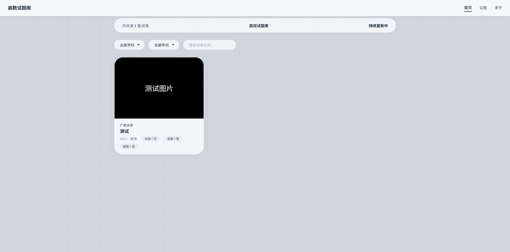
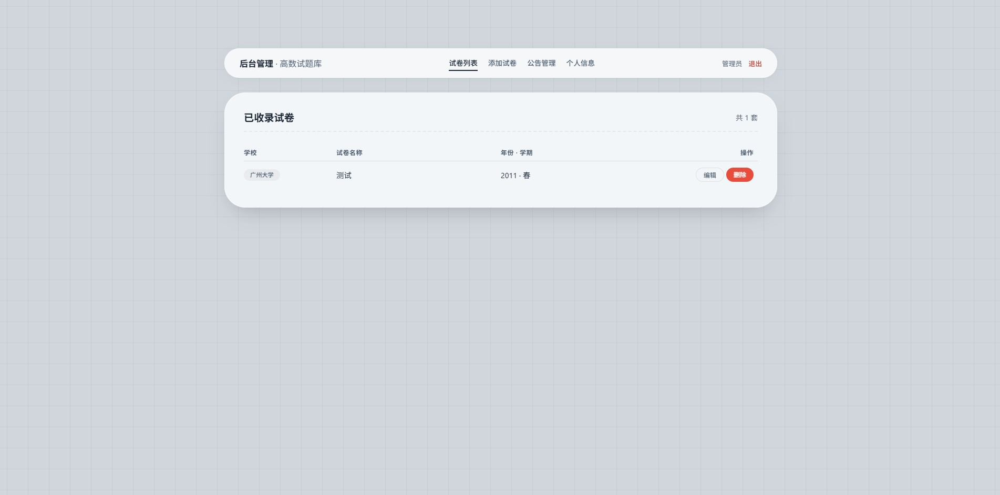

# 📐 高数试题库 · 个人试题管理平台

> 轻量级个人试题整理与分享系统 · 基于 PHP + SQLite

[](https://php.net)
[](https://sqlite.org)
[](LICENSE)

## 💡 这是什么

这是一个 **个人试题管理平台**，你可以用它来：

- 📚 整理收集到的各类试题（高数、专业课、考研题等）
- ✍️ 上传自己的解题思路与过程
- 📎 试卷、答案、解答一一对应，结构清晰
- 🌐 公开分享给同学或网友

你可以把它当成：

| 用法 | 说明 |
|------|------|
| 📂 个人知识库 | 把你做过的题、整理过的解析全部存进来 |
| 🏫 高校试卷收集站 | 收集各校真题，方便备考复盘 |
| 📓 刷题复盘本 | 记录错题和详细解答过程 |
| 👥 学习资料分享站 | 建一个公开的小型资料站 |

## ✨ 功能特点

- ✅ 轻量级，无需 MySQL，一个 SQLite 文件搞定
- ✅ 支持图片上传（试卷扫描件、手写解答拍照）
- ✅ 每套试卷可独立管理：试卷图 + 标准答案 + 个人解答
- ✅ 后台管理，密码保护，添加/编辑/删除试卷
- ✅ 首页按卡片展示，支持按学校、年份筛选
- ✅ 图片预览器：缩放、拖动、切换、缩略图导航
- ✅ 公告系统，可通知访问者
- ✅ 响应式设计，手机/平板/电脑都能看

## 📸 预览截图

### 前端首页



### 后台管理



## 🛠️ 技术栈

| 技术 | 说明 |
|------|------|
| PHP 7.4+ | 后端逻辑 |
| SQLite 3 | 数据库（一个文件搞定） |
| HTML5 + CSS3 | 前端界面 |
| Vanilla JavaScript | 交互功能 |

## 📂 目录结构

| 路径 | 说明 |
|------|------|
| `admin/` | 后台管理 |
| `assets/` | 静态资源（CSS/JS） |
| `database/` | 数据库目录（安装后生成） |
| `uploads/` | 上传图片目录 |
| `detail.php` | 试卷详情页 |
| `index.php` | 首页 |
| `install.php` | 安装脚本（安装后请删除） |
| `.gitignore` | Git 忽略文件 |
| `LICENSE` | 开源协议 |
| `README.md` | 项目说明 |

## 🚀 快速部署

### 环境要求

| 环境 | 版本 |
|------|------|
| PHP | 7.4+（需开启 PDO_SQLITE） |
| Web Server | Apache / Nginx |

### 安装步骤

1. **下载代码**

```bash
git clone https://github.com/HIWB/gaoshushitiku.git
cd gaoshushitiku
```

2. **上传到服务器**

将项目文件上传到网站根目录（如 `public_html` 或 `htdocs`）

3. **设置目录权限**

```bash
chmod 755 database/
chmod 755 uploads/
```

4. **运行安装脚本**

访问：`http://你的域名/install.php`

看到 **"✅ 数据库安装成功！"** 即可。

5. **删除安装脚本**

⚠️ **必须删除** `install.php` 文件

6. **登录后台**

访问 `http://你的域名/admin/login.php`

默认密码：`admin123`

## 🔒 安全建议

| 项目 | 建议 |
|------|------|
| `install.php` | ⚠️ **安装完成后必须删除** |
| 默认密码 | 登录后台后**立即修改** |
| `uploads/` 目录 | 确保有 `.htaccess` 防止目录浏览 |
| 数据库备份 | 定期备份 `database/papers.db` |

## 📧 联系与反馈

- 作者：[小源](https://github.com/HIWB)
- 项目地址：[https://github.com/HIWB/gaoshushitiku](https://github.com/HIWB/gaoshushitiku)
- 如有问题，请提交 [Issues](https://github.com/HIWB/gaoshushitiku/issues)

## 📄 许可证

MIT License © 2026 小源

---

**如果这个项目对你有帮助，欢迎 ⭐ Star 支持！**
